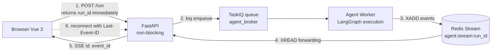
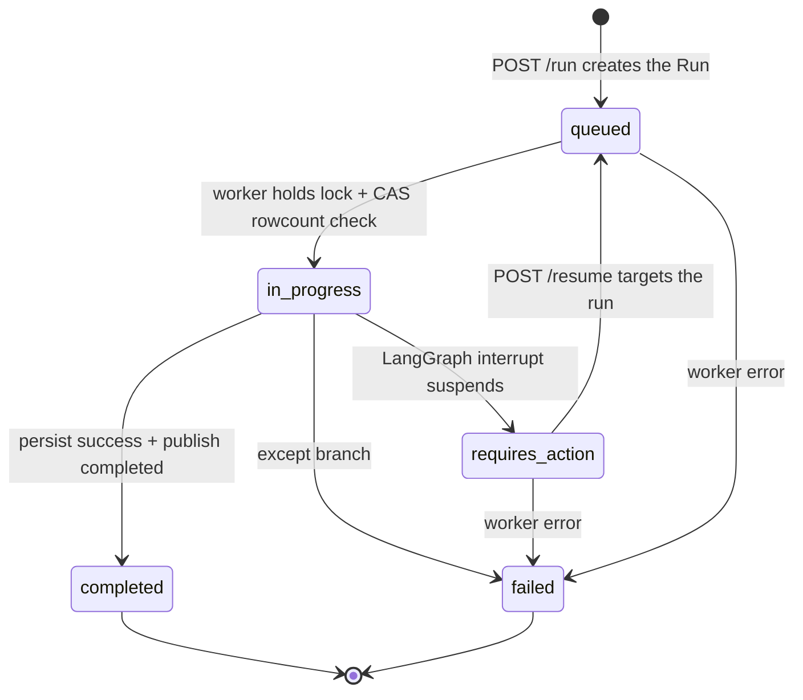
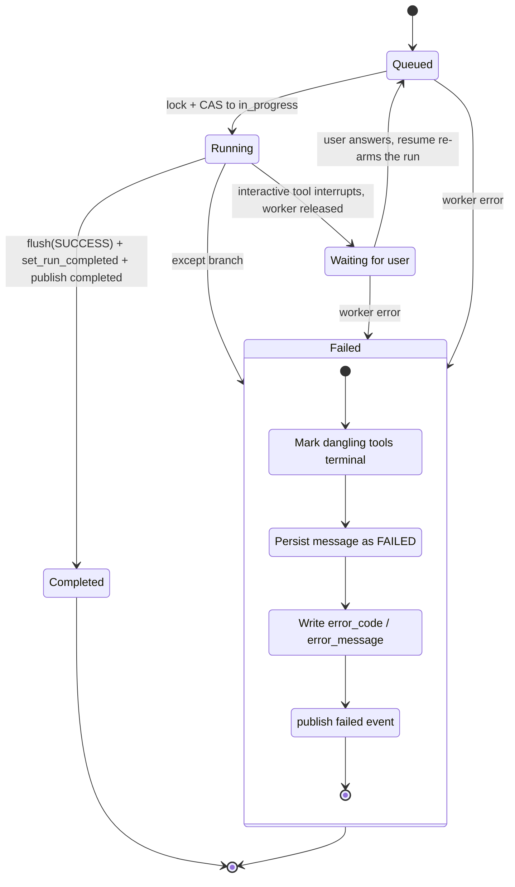
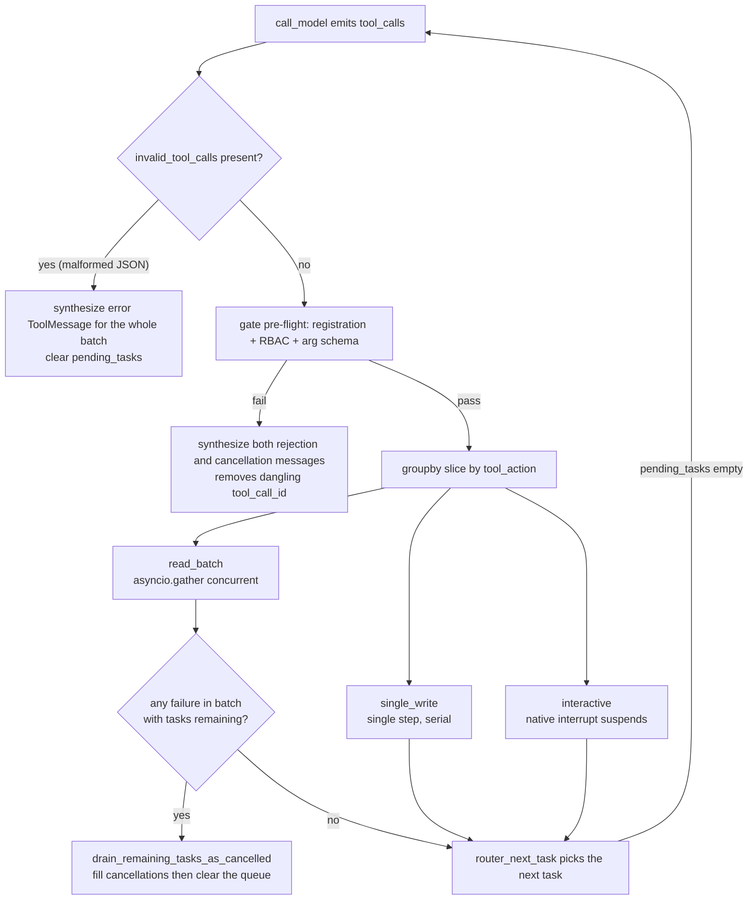
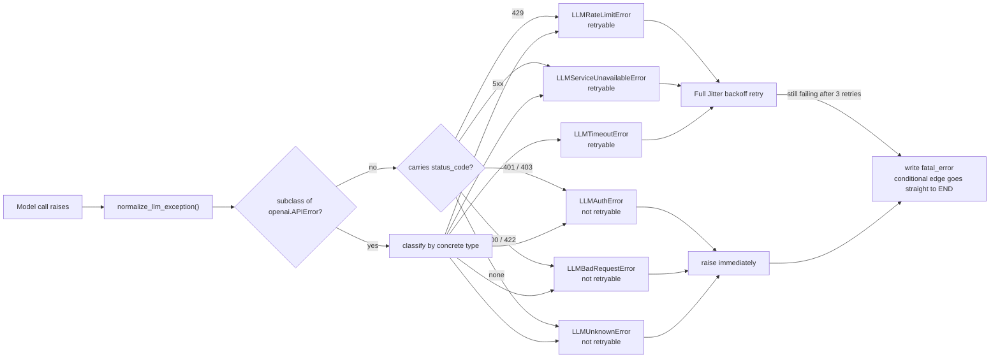
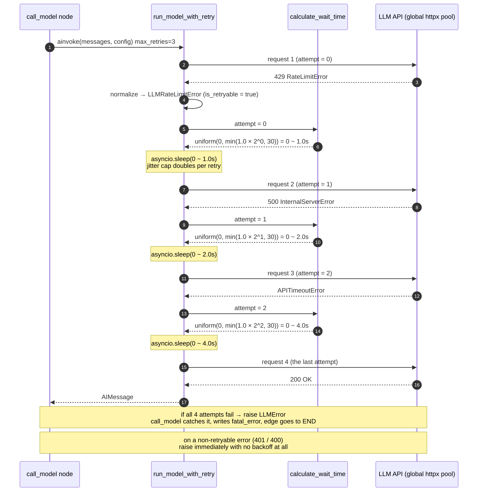

# Cloud Classroom

[简体中文](README.md) | **English**

A mini online-teaching platform in the spirit of Chaoxing's Xuexitong, covering the full loop of **courses → resources → assignments → knowledge base → AI Q&A**.

The backend is hand-written by me, line by line. The frontend is mostly vibe-coded — so the backend architecture is fairly deliberate while the UI just needs to work and look decent. The two styles don't quite match, apologies in advance.

**Tech stack**: Python · FastAPI · LangGraph · LangChain · TaskIQ · Milvus · PostgreSQL · Redis · Vue 3

---

## Highlights

### 1. Asynchronous, event-driven execution with incremental stream replay

Solves two problems: model inference blocking HTTP requests, and content loss when a weak network drops mid-stream.

- **Decoupled execution and communication**: the Web API only does lightweight job submission and status subscription — `POST /run` creates the Run record, immediately `kiq()`s the task and returns a `run_id`. Model interaction and tool execution all live in the TaskIQ worker pool.
- **Two physically separate queues**: `merge_broker` (chunk merging, deliberately does *not* load RAG/Milvus so the process stays light) and `agent_broker` (real-time Agent, needs RAG + the graph) run their own workers and never compete for resources.
- **Incremental state replay**: every Agent run is abstracted into standard events written to a **per-run** Redis Stream (`agent:stream:{run_id}`) —
  `in_progress` / `thought_delta` / `text_delta` / `tool_call` / `tool_result` / `requires_action` / `completed` / `failed`.
  FastAPI forwards them as SSE via `XREAD`, and the client resumes incrementally with `Last-Event-ID` (Redis `XREAD` means "give me entries greater than this id", so nothing is duplicated or lost by construction).
- The frontend implements reconnect with exponential backoff + `Last-Event-ID`, heartbeat-based liveness detection, and replay-on-reconnect after a refresh.



### 2. Dual-layer state machine and single-active-run guarantee

Solves state corruption and concurrent write-through.

- **Dual-layer lifecycle**: the upper LangGraph layer only owns the model context and the **pending-tool pointer** (`messages` + `pending_tasks`) plus an `AsyncPostgresSaver` checkpoint; the business layer independently maintains the Run lifecycle state machine (`queued → in_progress → requires_action → completed / failed`). The two never contaminate each other.
- **Guarded CAS**: every transition is a conditional `UPDATE ... WHERE status = <previous state>`, and the **affected row count is checked** to decide who won.
  E.g. a worker claiming execution: `WHERE status IN ('queued')` → `in_progress`, and `rowcount != 1` means someone else got there first, so it gives up. On resume, a lost race for `REQUIRES_ACTION → QUEUED` returns 409.
- **Three tiers of concurrency protection** (a distributed lock lease can expire during a long task, so correctness is never bet on the lock alone):
  1. **Redis distributed lock**: acquired with `SET NX EX`, value is a UUID token, released by a Lua script that **verifies the token before deleting** (so you never delete someone else's lock), with a **watchdog that renews the lease**;
  2. **In-lock re-validation** (check-then-act): once the lock is held, re-read the Thread status, the idempotency key, and whether an active Run already exists;
  3. **Database conditional unique index** as the backstop: a **partial unique index** on `(thread_id)` with `WHERE status IN ('queued','in_progress','requires_action')`, guaranteeing at the storage layer that a thread has at most one active Run.
- **Client idempotency key**: unique constraint on `(user_id, idempotency_key)`. A repeated request **idempotently returns the same Run** (it does not start a second turn); you only get a **409** if the same key is reused against a different Thread, or that Thread already has an active Run.



**Worker task state transitions** (including the full failure-path cleanup):



> `canceled` is reserved in the enum (and already a member of the route's terminal set), but neither a cancel endpoint nor worker-side cancellation detection exists yet, so it is currently unreachable.

### 3. Tool side-effect scheduling, protocol guard and HITL

Solves runaway tool calls, the 400-broken calls caused by dangling `tool_call_id`s, and long tasks squatting on a worker while waiting for user input.

- **Metadata-driven classification**: every tool carries `ToolMetadata` — `allowed_roles` (RBAC), `tool_action` (`read` / `write` / `interactive`), `interrupt_policy` (`require_approval` / `require_input`).
- **RBAC defense in depth**: tools are filtered by role *before* being bound to the model (so prompt injection cannot reach privileged tools), and registration + role + argument schema are **validated again** right before execution.
- **Central gate**: if the model emits a call whose JSON isn't even valid, the gate synthesizes standard error messages for the **whole batch**; if pre-flight validation (registration / permission / arguments) fails, it synthesizes both a rejection message *and* cancellation messages for the remaining calls — **every `tool_call` gets a matching `ToolMessage`**, so no dangling ids are ever left behind.
- **Sliced scheduling**: the gate `groupby`s the calls of a turn by `tool_action` —
  **consecutive reads are aggregated into one `read_batch` executed concurrently with `asyncio.gather`**; **writes are split into single steps** (one approval + one transaction each); interactive tools run one at a time.
- **Fail-fast**: if any tool in a batch fails and tasks remain, the remaining queue is **drained and filled with cancellation messages** instead of continuing.
- **Native interrupt (HITL)**: `GraphInterrupt` / `NodeInterrupt` raised by interactive tools propagate upward, LangGraph suspends the session and **releases the worker**; the user's answer re-arms the run through a dedicated resume endpoint.
- **Crash self-healing**: after a worker is SIGKILLed and restarts, it **scans history backwards** to determine where the interruption happened (last message is a HumanMessage / an AIMessage carrying tool calls / a ToolMessage), fills in the missing ToolMessages (`status=error`) and AIMessage, then appends the new user input — so a dirty message sequence can't kill subsequent calls.
- **Dual-track persistence**: the business database stores `Message.parts` (JSONB) as the UI-visible execution timeline (reasoning, tool input/output, statuses), while the LangGraph checkpoint only stores the message graph and tool pointers fed to the model. The two write paths are independent (one over the asyncpg pool, one over the psycopg pool), so the frontend audit trail never eats into the prompt context.



> Note: the `single_write_node` is already sliced out by the gate, but the current toolset has no write-class tool, so that node is not registered in the graph (the path is unreachable). The `require_approval` flow also only exists as enum and metadata for now; what actually works today is `require_input` (the `ask_user_question` clarification).

### 4. Agentic RAG pipeline with autonomous retrieval decisions

Solves "do I need a new session to ask about another course?" and recall precision.

- **Retrieval is a controlled tool, not a fixed pipeline**: knowledge search is wrapped as a `rag` tool handed to the Agent, which decides **whether and when to retrieve**. The retrieval scope (course) is injected server-side from config, so **the model cannot pick the knowledge base itself**.
- **Per-turn course switching**: `scope` / `scope_id` live at the **Run** level rather than the Thread level — turn 1 can target *Calculus* and turn 2 *Data Structures* within the same session, so students can ask across courses **without creating a new session**.
- **Hybrid retrieval + RRF fusion**: Milvus holds both a dense and a sparse vector field; writes only supply the dense vector and the **sparse vector is generated server-side by the built-in BM25**. Retrieval issues two `AnnSearchRequest`s and reranks with `RRFRanker` (reciprocal rank fusion).
- **Scalar inverted indexes for pre-filtering**: `INVERTED` indexes on `scope_id` / `file_record_id` / `file_hash` / `knowledge_doc_id` narrow the candidate set before the vector search.
- **Indexing pipeline**: parse (docx via `anydoc`, markdown decoded directly) → split (Markdown / recursive splitter) → batch embed (custom `HttpxEmbedder`, batch 16) → write to Milvus → write chunk rows back. Any failing step rolls back and **cleans up the vectors already written**, leaving no garbage.
- **Four swappable extension points (plugin assembly)**: RAG is not a hard-coded pipeline but a "composition root + two registries + lifecycle management" structure — parsers and splitters are **registered by name and instantiated on demand** (stateless, a fresh instance each time), while the embedder and vector store are **built by factories from configuration** (stateful, started and stopped by the container).

  | Extension point | Abstract base | Current implementation | Wiring |
  |---|---|---|---|
  | Document parsing | `BaseParser` (`ABC`) | `DocxParser` / `MarkdownParser` | looked up by file extension |
  | Chunking strategy | `BaseSplitter` (`ABC`) | `MarkdownSplitter` / `RecursiveSplitter` | `FR_RAG_SPLITTER_TYPE` |
  | Embedding | `BaseEmbedder` (`LifecycleComponent`) | `HttpxEmbedder` | `FR_RAG_EMBEDDER_TYPE` |
  | Vector store | `BaseVectorStore` (`LifecycleComponent`) | `MilvusVectorStore` | `FR_RAG_VECTOR_STORE_TYPE` |

  ```mermaid
  flowchart TD
      S["settings<br/>FR_RAG_* config"] --> C["RAGContainer composition root"]
      C -->|"lookup by file extension"| P["BaseParser<br/>DocxParser / MarkdownParser"]
      C -->|"lookup by strategy name"| SP["BaseSplitter<br/>MarkdownSplitter / RecursiveSplitter"]
      C -->|"build by rag_embedder_type"| E["BaseEmbedder<br/>HttpxEmbedder"]
      C -->|"build by rag_vector_store_type"| V["BaseVectorStore<br/>MilvusVectorStore"]
      E --> LC["LifecycleComponent<br/>unified startup / shutdown"]
      V --> LC
      C -->|"on startup failure, roll back in reverse"| LC
  ```

  A few deliberate design choices:

  - **Stateful / stateless split**: components that need connections inherit `LifecycleComponent` (getting a uniform `startup` / `shutdown` contract), while the stateless parsers and splitters only inherit `ABC` and carry no lifecycle baggage.
  - **Reverse rollback on startup failure**: if any component fails to come up inside `startup()`, the already-started ones are shut down in **reverse order** before re-raising, so a half-initialized connection is never left behind.
  - **Fail loudly when not ready**: accessing `embedder` / `vector_store` before the container started raises `RuntimeError` instead of leaking a `None` into business code; an unregistered extension or splitter strategy also raises with a clear message.
  - **Cheap to extend**: swapping the vector store or the embedding service means adding one implementation class plus one factory branch — the upper-layer retrieval and indexing code is untouched; adding a document format is just registering one more extension mapping.

> Boundaries worth stating clearly: BM25 and RRF use **Milvus built-in capabilities** (`FunctionType.BM25` + `RRFRanker`); there is no self-implemented retrieval algorithm in the codebase. Retrieval currently filters by `scope_id` only; `scope_id` comes from the client and the server does not yet verify course ownership (a privilege-escalation risk). The document parser registry currently only covers docx and md.

### 5. Model exception classification and Full Jitter retry

LLM calls are the flakiest part of the system, so both the **exception taxonomy** and the **retry rhythm** are made explicit.

- **Exception normalization**: `normalize_llm_exception()` normalizes OpenAI SDK exceptions (plus any exception carrying a `status_code`) into 6 domain exceptions, each carrying an `is_retryable` flag. **Non-retryable failures fail immediately**, with no pointless backoff.
- **Full Jitter backoff**: retryable errors compute a cap as `min(initial_delay × 2^attempt, max_delay)` and then sleep `random.uniform(0, cap)` — AWS's recommended **Full Jitter**, which spreads out the retry thundering herd across many concurrent clients. Default is 3 retries.
- **Graceful failure**: when retries are exhausted or the error is non-retryable, the node writes `fatal_error` and lets the conditional edge go straight to `END`, emitting a message that explains the reason instead of hanging the turn.
- **Connection control lives elsewhere**: all model calls share one **global `httpx.AsyncClient` keep-alive pool** (`max_connections=200`, `max_keepalive_connections=50`, 120 s read timeout), and client-level retries are explicitly disabled (`max_retries=0`) so the retry rhythm is fully owned by the logic above. Embedding uses its own separate pool.

**Model exception classification matrix**

| Normalized error | Typical status | Upstream exception | Retryable | Handling |
|---|---|---|---|---|
| `LLMAuthError` | 401 / 403 | `AuthenticationError` | ❌ | raise immediately (retrying bad credentials is pointless) |
| `LLMRateLimitError` | 429 | `RateLimitError` | ✅ | jittered backoff retry |
| `LLMBadRequestError` | 400 / 422 | `BadRequestError` / `UnprocessableEntityError` | ❌ | raise immediately (bad arguments / format) |
| `LLMServiceUnavailableError` | 500 / 5xx | `InternalServerError` | ✅ | jittered backoff retry |
| `LLMTimeoutError` | none | `APIConnectionError` / `APITimeoutError` | ✅ | jittered backoff retry |
| `LLMUnknownError` | unknown | fallback | ❌ | raise immediately |



**Retry sequence with jitter**



### 6. Atomic file transfer and low-level resource governance

Solves the resource cost of large uploads/merges and connection pools being dragged down by long tasks.

- **Session state maintained atomically by Redis Lua**: four scripts (session creation, chunk registration, status CAS, terminal cleanup) complete "session metadata + received-chunk set + TTLs of several keys" in a single `EVAL`, avoiding intermediate states between round trips.
- **Resumable upload + cross-user instant upload**: `init` that hits an existing session reads back the received-chunk set; `file_hash` has a **unique constraint**, so a hit returns the existing file record (`instant_upload`) and not a single byte is uploaded — deduplication across users for free.
- **Async merge with single-pass streaming verification**: merging runs in a TaskIQ worker and updates SHA-256 **inside the very same loop that reads chunks and writes the final file** — eliminating the second full disk read of "merge first, then re-read to hash". The heavy work runs in `asyncio.to_thread`, so the event loop never blocks.
- **Atomic landing**: both chunks and the final artifact are first written to uuid / `.tmp` names and then `os.replace`d atomically; a CAS claim of `uploading → merging` prevents duplicate merges; failure paths reclaim leftover files.
- **"Acquire and release" for long streaming endpoints**: the SSE route does **not** hold a database session during long polling — each status check briefly opens a session and returns it immediately, so one long-lived connection can't pin a database connection until the browser closes.
- **Connection pools isolated per process** (API / Worker / Checkpointer are three independent pools that never crowd each other out; all quotas are hard-coded):

  | Consumer | Pool type | Quota | Process |
  |---|---|---|---|
  | Web API | asyncpg engine | `pool_size=10` + `max_overflow=10` | FastAPI |
  | Background worker | asyncpg engine | `pool_size=5` + `max_overflow=15` | TaskIQ worker |
  | LangGraph Checkpointer | psycopg `AsyncConnectionPool` | `max_size=8` | agent worker only |
  | Model calls | `httpx.AsyncClient` | `max_connections=200`, keepalive 50 | agent worker only |
  | Embedding | `httpx.AsyncClient` | `max_connections=100`, keepalive 20 | rag container |
  | Redis | connection pool | `max_connections=500` | one per process |

  Worst case Postgres connections ≈ 20 + 20 + 20 + 8 = **68**, below the default PG limit of 100 (the code comments also note this is a stopgap and that PgBouncer should come later).
- **Lazy client initialization**: Milvus / Redis / the model client / the checkpoint pool are all initialized on demand in the lifespan or the TaskIQ worker startup event, never at module import time.

---

## What is implemented

Backend endpoints that are real, and frontend code that really talks to them:

- Auth: JWT (access + refresh), refresh token in an HttpOnly cookie, automatic refresh-and-replay on 401
- Permissions: three-tier RBAC (student / teacher / admin)
- File upload: chunked upload init → chunk → merge → status, with SHA-256 instant upload and resumable upload; merging runs in a dedicated TaskIQ worker
- Course / enrollment / course resources: create a course, enroll, list a course's students, bind and query resources by course
- Knowledge base: parse → chunk → embed into Milvus, with retrieval isolated per course
- AI Q&A: LangGraph state machine, TaskIQ async execution, Redis Stream feeding SSE, with clarification interrupts and resume

The frontend UI itself is complete:

- Login/signup, dashboard (echarts charts), course plaza, my courses
- Course workspace: overview / resources / assignments / grades / announcements / discussions / student management
- Knowledge base management: upload & index, status display, and a three-view detail drawer (parsed content / original document / chunks)
- AI Q&A: full-screen immersive chat with multi-session concurrency, refresh-proof state, SSE resume, session deep links, Markdown export, math and code highlighting
- Light / dark themes

## What is not implemented

The backend only covers the parts above; **most of the regular CRUD surface is still empty**:

- Assignments: create / list / detail / delete / submit / grade / deadline reminders (tables exist, endpoints don't)
- Grades: teacher grade table, student's own grades
- Courses: course list, courses I teach, courses I take, course detail, update and delete
- Enrollment: dropping a course
- Files: unified download and preview endpoints; deleting course resources
- Knowledge base management: document list / detail / delete / enable-disable / chunk editing / re-index
- Announcements, discussions, notifications, dashboard stats: the tables themselves don't exist yet

So the UI looks complete, but **quite a few pages are mocked in the frontend**. There is a `USE_MOCK` switch in `frontend/src/config.ts`, `true` by default: unimplemented endpoints return demo data; set it to `false` and everything goes to the real backend, where missing endpoints show an "endpoint not available" placeholder instead. Once the backend catches up, no page code needs to change.

## Run it

You need PostgreSQL, Redis and Milvus (Milvus is only used by the knowledge base and Q&A; the rest runs without it).

```bash
# Backend
cd backend
pip install -r requirements.txt
uvicorn app.main:app --reload --port 8000

# In two more terminals, run the workers for the two queues
taskiq worker app.core.broker:merge_broker
taskiq worker app.core.broker:agent_broker

# Frontend
cd frontend
npm install
npm run dev        # http://127.0.0.1:5173, /api is proxied to 127.0.0.1:8000
```

Configuration lives in `backend/.env` with keys prefixed `FR_` (`FR_DATABASE_URL`, `FR_MILVUS_URI`, `FR_API_KEY`, …); that file is not committed.

Demo accounts all use the password `123456`: `teacher_li` (teacher), `student_zhang` / `student_wang` (students), `admin`.

## Notes

- The backend is hand-written; the frontend is vibe-coded, with the focus on UI and interaction.
- This is a learning project for now.
