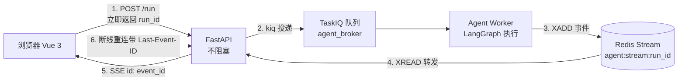
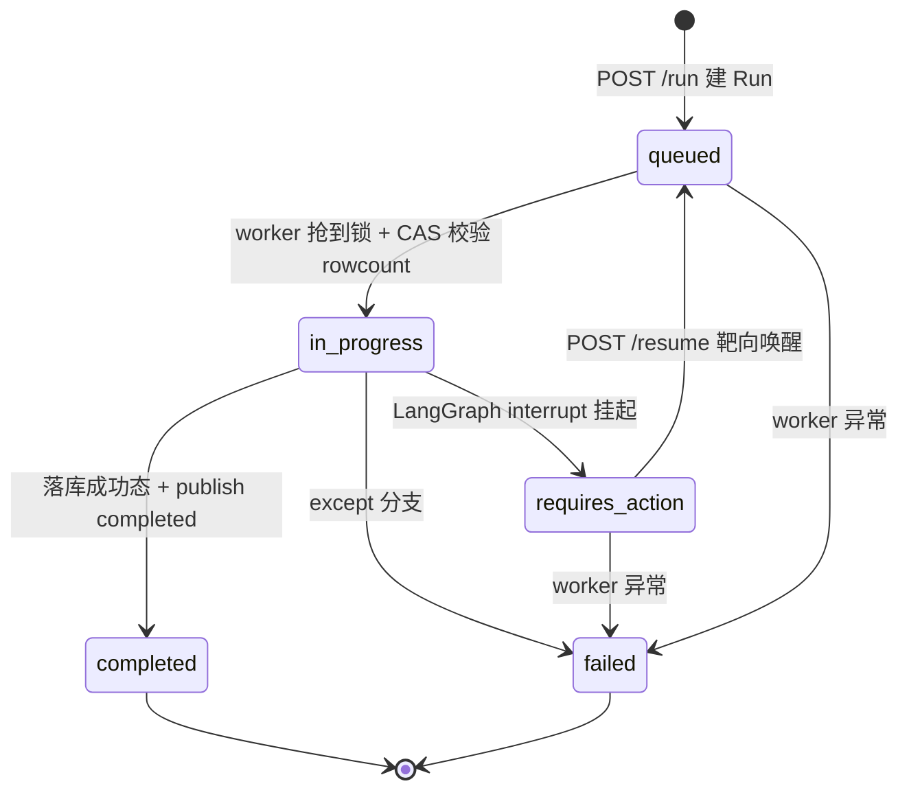
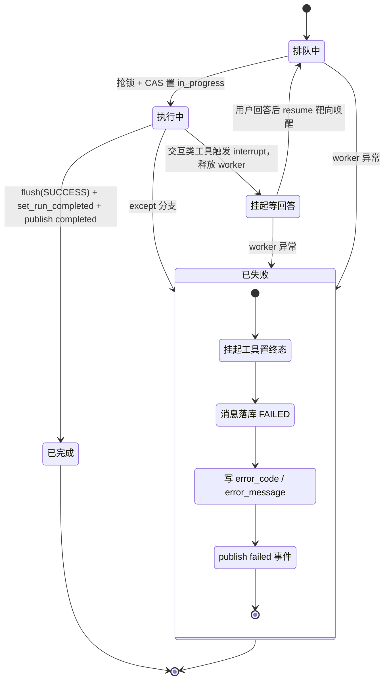
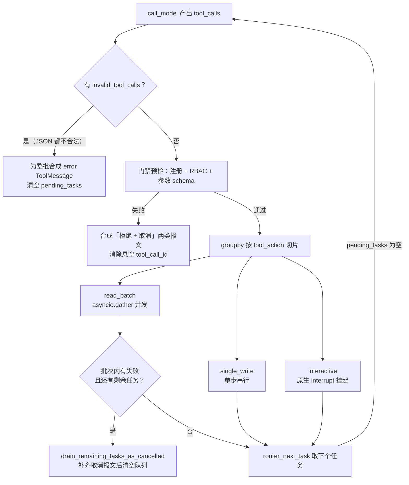
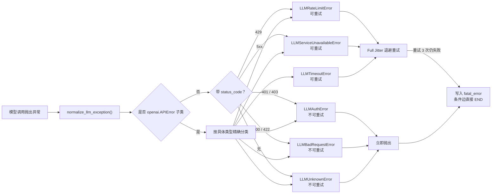
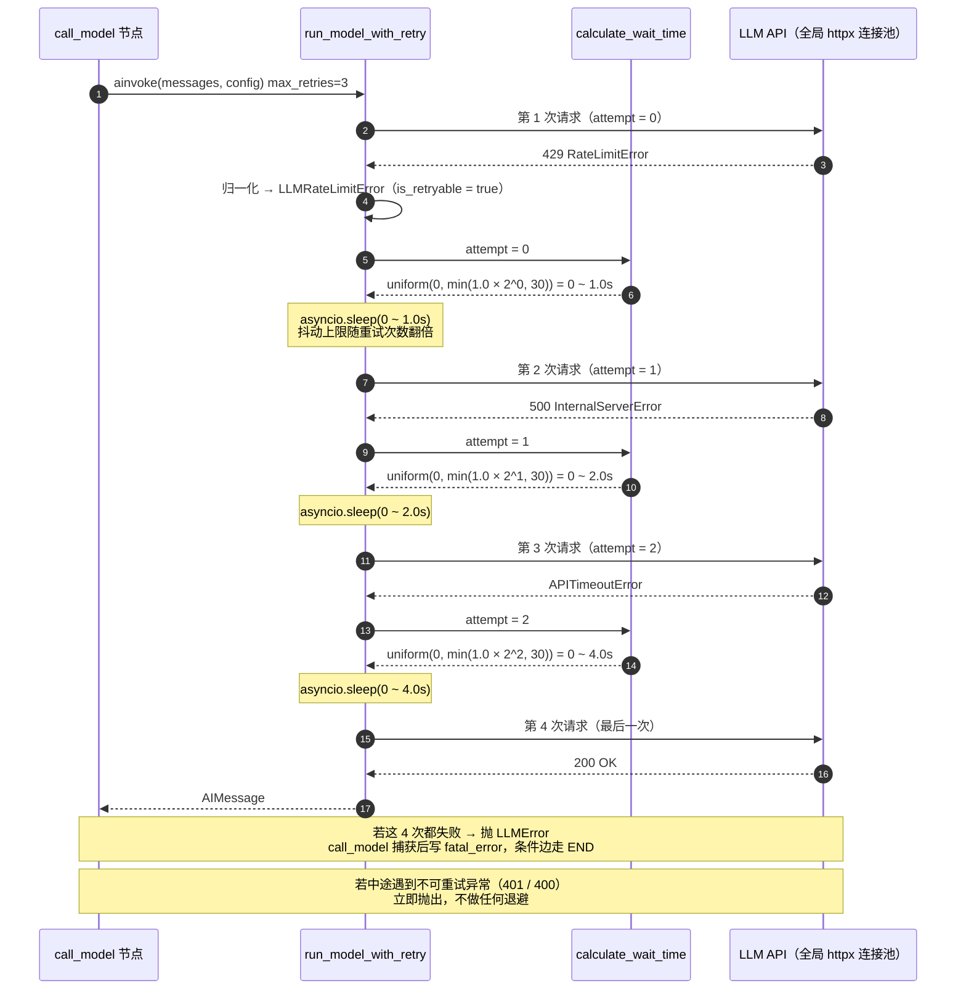

# 云课堂

一个迷你在线教学平台，对标学习通。功能上想做的是「课程 → 资源 → 作业 → 知识库 → AI 问答」这条完整链路。

后端是我自己一行行手敲的，前端基本是 vibe coding 出来的 —— 所以后端结构上比较讲究，前端只求好用好看，两边风格不太统一，见谅。

**技术栈**：Python · FastAPI · LangGraph · LangChain · TaskIQ · Milvus · PostgreSQL · Redis · Vue 3

---

## 项目亮点

### 一、异步事件驱动与增量续流

解决「模型推理阻塞请求」与「弱网中断后内容丢失」两个问题。

- **执行通信解耦**：Web API 只做轻量投递与状态订阅 —— `POST /run` 建好 Run 记录后立即 `kiq()` 投递任务并返回 `run_id`，模型交互与工具执行全部下沉到 TaskIQ Worker 任务池。
- **两个独立队列物理隔离**：`merge_broker`（分片合并，刻意不加载 RAG / Milvus，进程更轻）与 `agent_broker`（实时 Agent，需要 RAG + 图）各起各的 worker，互不抢占。
- **增量状态重放**：Agent 运行轨迹被抽象成标准事件写入 **per-run** 的 Redis Stream（`agent:stream:{run_id}`）——
  `in_progress` / `thought_delta` / `text_delta` / `tool_call` / `tool_result` / `requires_action` / `completed` / `failed`。
  FastAPI 侧用 `XREAD` 转发为 SSE，客户端凭 `Last-Event-ID` 做增量续播（Redis `XREAD` 语义是「取大于该 id 的条目」，天然不重不漏）。
- 前端对应实现断线重连（指数退避 + `Last-Event-ID`）、心跳存活判定、刷新后重连重放。



### 二、双层状态机与三级并发单活

解决「状态错乱」与「并发写穿」。

- **双层状态生命周期**：上层 LangGraph 只负责模型上下文与**待执行工具指针**（`messages` + `pending_tasks`），并挂 `AsyncPostgresSaver` 检查点；业务层独立维护 Run 生命周期状态机（`queued → in_progress → requires_action → completed / failed`），两层各管各的，互不污染。
- **前置条件 CAS**：状态迁移一律用 `UPDATE ... WHERE status = 前置态` 条件更新，并**校验受影响行数**判权。
  例如 worker 抢执行权：`WHERE status IN ('queued')` 置为 `in_progress`，`rowcount != 1` 就放弃执行（说明被其它请求抢先）；resume 侧 `REQUIRES_ACTION → QUEUED` 竞争失败直接返回 409。
- **三级防并发穿透**（长任务里分布式锁租期可能超时，所以不把正确性押在锁上）：
  1. **Redis 分布式锁**：`SET NX EX` 抢占，value 为 UUID token，释放时用 Lua **校验 token 后才删**（防止删掉别人的锁），并带 **watchdog 自动续期**；
  2. **锁内二次校验**（check-then-act）：拿到锁后重新查 Thread 状态、幂等键、是否已有活跃 Run；
  3. **数据库条件唯一索引**兜底：对 `(thread_id)` 建**部分唯一索引**（`WHERE status IN ('queued','in_progress','requires_action')`），从存储层保证「一个会话同时只有一个活跃 Run」。
- **客户端幂等键**：`(user_id, idempotency_key)` 唯一约束。重复请求**幂等返回同一个 Run**（不会多跑一轮）；把同一个 key 用到别的 Thread、或该 Thread 已有活跃 Run 才返回 **409**。



**Worker 任务状态转移**（含失败路径的完整收尾动作）：



> `canceled` 状态在枚举里预留（也已是路由的终态集合成员），但取消接口与 worker 侧取消检测尚未实现，目前不可达。

### 三、工具副作用调度、协议守卫与 HITL

解决「工具调用失控」「悬空 `tool_call_id` 导致 400 坏死调用」「长任务占着 worker 等用户输入」。

- **元数据分级**：每个工具带 `ToolMetadata` —— `allowed_roles`（RBAC）、`tool_action`（`read` / `write` / `interactive`）、`interrupt_policy`（`require_approval` / `require_input`）。
- **RBAC 深度防御**：工具先按角色过滤后才 `bind_tools` 给模型（提示词注入也调不到越权工具），执行前**再校验一次**工具注册 + 角色 + 参数 schema。
- **中央门禁**：模型若吐出连 JSON 都不合法的调用，门禁直接为**整批**调用合成标准错误报文；若预检（注册/权限/参数）不通过，则同时合成「拒绝报文 + 其余调用的取消报文」——**任何一条 tool_call 都有对应 ToolMessage**，不会留下悬空 id。
- **切片调度**：门禁按 `tool_action` 对同一轮的多个调用做 `groupby` 切片 ——
  **连续的读聚合为一个 `read_batch` 批次用 `asyncio.gather` 并发**；**写操作拆成单步**（单步审批 + 独立事务）；交互类单步执行。
- **快速失败**：批次里任一工具失败且后面还有任务，立刻**注销队列剩余任务并补齐取消报文**，不再往下跑。
- **原生中断（HITL）**：交互类工具触发的 `GraphInterrupt` / `NodeInterrupt` 直接向上透传，LangGraph 挂起会话并**释放 worker**；用户回答后由独立 resume 接口靶向唤醒续跑。
- **崩溃自愈**：worker 被强杀后重启，会**反向扫描历史消息**判断中断位置（最后一条是 HumanMessage / 带 tool_call 的 AIMessage / ToolMessage 三种形态），补齐缺失的 ToolMessage（`status=error`）与 AIMessage，再追加用户新输入，避免脏消息序列把后续调用打死。
- **双轨持久化**：业务库的 `Message.parts`（JSONB）单独存前端可视化的执行时间线（思考、工具出入参、状态），LangGraph 检查点只存喂给模型的消息图与工具指针 —— 两条写入路径彼此独立（一个走 asyncpg 池、一个走 psycopg 池），前端审计轨迹不会挤占 Prompt 上下文。



> 说明：写操作的 `single_write_node` 已在门禁处完成切片，但当前工具集里没有写类工具，该节点尚未注册进图（路径不可达）；`require_approval` 审批流目前也只有枚举与元数据预留，真正跑通的是 `require_input`（`ask_user_question` 反问）。

### 四、自主决策 Agentic RAG 管线

解决「跨学科提问要不要重建会话」与「召回精度」。

- **检索是受控工具，不是固定流程**：把知识检索封装成 `rag` 工具交给 Agent，由模型自主判定**是否需要检索、何时检索**；检索作用域（课程）由服务端从 config 注入，**模型无法自行指定知识库**。
- **多轮动态课程切换**：`scope` / `scope_id` 放在 **Run** 级而不是 Thread 级 —— 同一个会话里第 1 轮挂《高等数学》、第 2 轮切《数据结构》都能正确检索，学生跨课程连续提问**不需要新建会话**。
- **混合检索 + RRF 融合**：Milvus 侧同时建稠密向量与稀疏向量两个字段，写入时只给稠密向量，**稀疏向量由服务端内建 BM25 自动生成**；检索时发两路 `AnnSearchRequest`，用 `RRFRanker`（倒数排名融合）重排后返回。
- **标量倒排索引加速前置过滤**：对 `scope_id` / `file_record_id` / `file_hash` / `knowledge_doc_id` 建 `INVERTED` 索引，先按元数据过滤再向量检索，削减候选集。
- **入库链路**：解析（docx 走 `anydoc`、md 直接解码）→ 分块（Markdown / 递归分块器）→ 批量向量化（自研 `HttpxEmbedder`，batch 16）→ 写 Milvus → 回写分块记录；任一步失败都会回滚并**清理已写入的向量**，不留脏数据。
- **四个可替换的扩展点（插件化装配）**：RAG 不是写死的管线，而是「组合根 + 双重注册表 + 生命周期管理」的结构 —— 解析器与分块策略**按名字注册、按需实例化**（无状态，每次 new），向量化与向量库**按配置从工厂构建**（有状态，由容器统一 startup / shutdown）。

  | 扩展点 | 抽象基类 | 当前实现 | 装配方式 |
  |---|---|---|---|
  | 文档解析 | `BaseParser`（`ABC`） | `DocxParser` / `MarkdownParser` | 按文件后缀查注册表 |
  | 分块策略 | `BaseSplitter`（`ABC`） | `MarkdownSplitter` / `RecursiveSplitter` | `FR_RAG_SPLITTER_TYPE` |
  | 向量化 | `BaseEmbedder`（`LifecycleComponent`） | `HttpxEmbedder` | `FR_RAG_EMBEDDER_TYPE` |
  | 向量库 | `BaseVectorStore`（`LifecycleComponent`） | `MilvusVectorStore` | `FR_RAG_VECTOR_STORE_TYPE` |

  ```mermaid
  flowchart TD
      S["settings<br/>FR_RAG_* 配置"] --> C["RAGContainer 组合根"]
      C -->|"按文件后缀查注册表"| P["BaseParser<br/>DocxParser / MarkdownParser"]
      C -->|"按策略名查注册表"| SP["BaseSplitter<br/>MarkdownSplitter / RecursiveSplitter"]
      C -->|"按 rag_embedder_type 构建"| E["BaseEmbedder<br/>HttpxEmbedder"]
      C -->|"按 rag_vector_store_type 构建"| V["BaseVectorStore<br/>MilvusVectorStore"]
      E --> LC["LifecycleComponent<br/>统一 startup / shutdown"]
      V --> LC
      C -->|"启动失败则反向回滚"| LC
  ```

  几个刻意的设计点：

  - **有状态 / 无状态分离**：需要连接资源的组件继承 `LifecycleComponent`（拿到统一的 `startup` / `shutdown` 契约），无状态的解析器与分块器只继承 `ABC`，不背生命周期包袱。
  - **启动失败反向回滚**：`startup()` 里任一组件拉起失败，会按**相反顺序**关掉已启动的组件再抛出异常，不会留下半初始化的连接。
  - **未就绪即报错**：容器未启动时访问 `embedder` / `vector_store` 直接抛 `RuntimeError`，不让 `None` 流进业务代码；未注册的后缀或分块策略也会带明确信息抛错。
  - **扩展成本低**：换向量库 / 换 embedding 服务只需新增一个实现类并在工厂加一个分支，检索与入库的上层业务代码不用改动；加一种文档格式只需注册一个后缀映射。

> 需要说清的边界：BM25 与 RRF 用的是 **Milvus 内建能力**（`FunctionType.BM25` + `RRFRanker`），代码里没有自研检索算法；检索侧目前只用 `scope_id` 过滤；`scope_id` 由客户端传入且服务端尚未做课程归属校验（越权风险，见「已知限制」）；文档解析器当前只注册了 docx 与 md。

### 五、模型异常分类与 Full Jitter 重试

大模型调用是最容易抖动的一环，这里把「异常分类」和「重试节奏」都做成了显式规则。

- **异常归一化**：`normalize_llm_exception()` 把 OpenAI SDK 的异常（以及任何带 `status_code` 的异常）统一归一成 6 类领域异常，每类自带 `is_retryable` 标记。**不可重试的立刻失败，不做无意义的退避**。
- **Full Jitter 退避**：可重试异常按 `min(initial_delay × 2^attempt, max_delay)` 算出上限，再取 `random.uniform(0, 上限)` —— 即 AWS 推荐的 **Full Jitter**，用于打散大量并发客户端的重试脉冲。默认重试 3 次。
- **失败优雅收尾**：重试耗尽或遇到不可重试异常时，节点写入 `fatal_error` 并让条件边直接走向 `END`，同时产出一条说明原因的消息，而不是让整轮卡死。
- **连接控制在别处**：所有模型调用共享一个**全局 `httpx.AsyncClient` 长连接池**（`max_connections=200`、`max_keepalive_connections=50`、读超时 120s），客户端级重试被显式关掉（`max_retries=0`），重试节奏完全由上面的逻辑掌控；向量化另用一套独立连接池。

**模型异常分类状态矩阵**

| 归一化异常 | 典型状态码 | 上游异常 | 可重试 | 处理 |
|---|---|---|---|---|
| `LLMAuthError` | 401 / 403 | `AuthenticationError` | ❌ | 立即抛出（凭证问题重试无意义） |
| `LLMRateLimitError` | 429 | `RateLimitError` | ✅ | Jitter 退避重试 |
| `LLMBadRequestError` | 400 / 422 | `BadRequestError` / `UnprocessableEntityError` | ❌ | 立即抛出（参数/格式问题） |
| `LLMServiceUnavailableError` | 500 / 5xx | `InternalServerError` | ✅ | Jitter 退避重试 |
| `LLMTimeoutError` | 无 | `APIConnectionError` / `APITimeoutError` | ✅ | Jitter 退避重试 |
| `LLMUnknownError` | 未知 | 兜底 | ❌ | 立即抛出 |



**带 Jitter 的重试时序**



### 六、文件原子传输与底层资源治理

解决「大文件上传/合并的资源占用」与「连接池被长任务拖垮」。

- **Redis Lua 原子维护会话**：会话创建、分片登记、状态 CAS、终态收尾四个 Lua 脚本，把「会话元信息 + 已收分片集合 + 多个 key 的 TTL」放在一次 `EVAL` 里完成，避免多次往返之间的中间态。
- **断点续传 + 跨用户秒传**：init 命中已存在会话即回读已收分片集合；`file_hash` 建**唯一约束**，命中即返回已有文件记录（`instant_upload`），不再上传一个字节，且天然跨用户去重。
- **合并异步化 + 单遍流式校验**：合并交给 TaskIQ worker，读分片写入最终文件的**同一个循环里增量更新 SHA-256** —— 省掉「先合并、再读一遍算哈希」的第二次全量磁盘 I/O；重活放在 `asyncio.to_thread`，不阻塞事件循环。
- **原子落地**：分片与成品都先写 uuid / `.tmp` 临时名再 `os.replace` 原子替换；合并前用 CAS 抢占 `uploading → merging` 防重复合并；失败路径回收残留文件。
- **长流式接口推行「取数即还」**：SSE 路由在长时间轮询里**不长期持有**数据库 session —— 每次只需查 Run 状态时短暂开一个 session，用完立即归还，避免一个长连接占死一个连接直到浏览器关闭。
- **连接池按进程物理隔离**（API / Worker / Checkpointer 是三套独立池，互不挤占；配额全为硬编码）：

  | 使用方 | 池类型 | 配额 | 进程 |
  |---|---|---|---|
  | Web API | asyncpg engine | `pool_size=10` + `max_overflow=10` | FastAPI |
  | 后台 Worker | asyncpg engine | `pool_size=5` + `max_overflow=15` | TaskIQ worker |
  | LangGraph Checkpointer | psycopg `AsyncConnectionPool` | `max_size=8` | 仅 agent worker |
  | 模型调用 | `httpx.AsyncClient` | `max_connections=200`、keepalive 50 | 仅 agent worker |
  | 向量化 | `httpx.AsyncClient` | `max_connections=100`、keepalive 20 | rag 容器 |
  | Redis | 连接池 | `max_connections=500` | 各进程各一份 |

  最坏情况 Postgres 连接数 ≈ 20 + 20 + 20 + 8 = **68**，低于 PG 默认上限 100（代码注释里也写明这是治标不治本，后续要上 PgBouncer）。
- **客户端按需初始化**：Milvus / Redis / 模型客户端 / 检查点连接池都在 lifespan 或 TaskIQ worker 启动事件里按需初始化，而非模块导入时建连。

---

## 已经实现的

后端真接口、前端真对接的部分：

- 鉴权：JWT（access + refresh），refresh token 走 HttpOnly Cookie，401 自动刷新并重放原请求
- 权限：学生 / 教师 / 管理员三级 RBAC
- 文件上传：分片上传 init → chunk → merge → status，带 SHA-256 秒传和断点续传，文件合并在独立的 TaskIQ worker 里跑
- 课程 / 选课 / 课程资源：创建课程、选课、查课程学生列表、资源绑定与按课程查询
- 知识库：文档解析 → 分块 → 向量化入 Milvus，按课程隔离检索
- AI 问答：LangGraph 状态机，TaskIQ 异步执行，Redis Stream 推 SSE 流式输出，支持反问中断和恢复

前端界面这块是完整的：

- 登录注册、工作台（echarts 数据看板）、课程广场、我的课程
- 课程空间：概述 / 资源 / 作业 / 成绩 / 公告 / 讨论 / 学生管理
- 知识库管理：上传索引 + 状态展示 + 详情三视图（解析内容 / 原始文档 / 分块）
- AI 问答：全屏沉浸式对话，多会话并发、刷新不丢、SSE 断线续传、会话深链、导出 Markdown、公式与代码高亮
- 浅色 / 深色主题

## 还没实现的

后端只做了上面那几块，**常规业务接口大部分还空着**：

- 作业：发布 / 列表 / 详情 / 删除 / 提交 / 批改 / 待办提醒（数据表建了，接口没写）
- 成绩：教师成绩表、学生我的成绩
- 课程：课程列表、我教的课、我学的课、课程详情、改和删
- 选课：退课
- 文件：统一下载、统一预览；课程资源删除
- 知识库管理：文档列表 / 详情 / 删除 / 启停 / 分块编辑 / 重新索引
- 公告、讨论、消息通知、工作台统计：连数据表都还没建

所以界面上看着很全，但**不少页面是前端 mock 出来的**。`frontend/src/config.ts` 里有个 `USE_MOCK` 开关，默认 `true`：未实现的接口返回演示数据；改成 `false` 就全走真实后端，缺的接口会显示「接口尚未提供」的占位。后端补齐后不用改页面代码。

## 跑起来

需要 PostgreSQL、Redis、Milvus（Milvus 只有知识库和问答用得上，不启也能跑其余功能）。

```bash
# 后端
cd backend
pip install -r requirements.txt
uvicorn app.main:app --reload --port 8000

# 另开两个终端，跑两个队列的 worker
taskiq worker app.core.broker:merge_broker
taskiq worker app.core.broker:agent_broker

# 前端
cd frontend
npm install
npm run dev        # http://127.0.0.1:5173，/api 已代理到 127.0.0.1:8000
```

配置写在 `backend/.env`，键名统一以 `FR_` 开头（`FR_DATABASE_URL`、`FR_MILVUS_URI`、`FR_API_KEY` 等），这个文件不入库。

演示账号密码都是 `123456`：`teacher_li`（教师）、`student_zhang` / `student_wang`（学生）、`admin`。

## 说明

- 后端是手写的；前端是 vibe coding 的，重心在界面和交互体验。
- 目前算是个练手项目。
